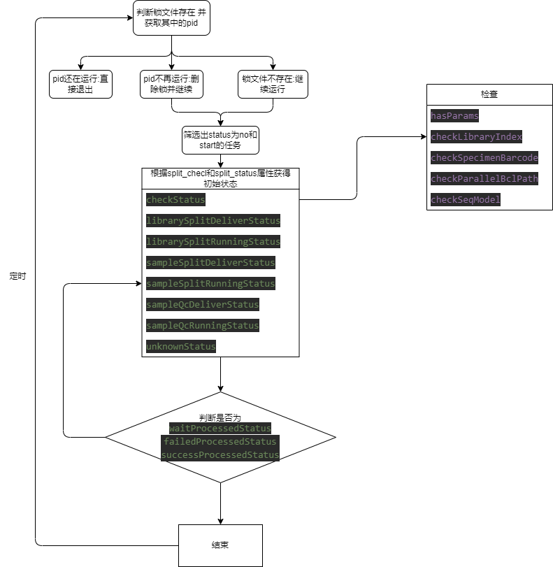
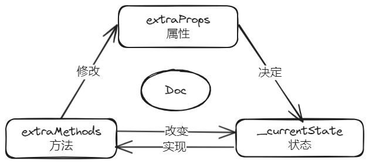

# 项目
这是基于node.js构建的一个程序，用于定期扫描mongodb中的数据，然后基于文档的信息进行不同的处理(采用ts-loader解析,基于webpack进行打包)。

## 项目简介
1. 目前拆分任务难以知道何时正确调用接口，所以需要一个中间件进行缓冲
2. 同时配置信息到等待接口生效还要一段时间，需要在配置信息之后立刻能够检查,目前上流很难进行

之前基于python写了一个定时程序，但基于新的需求和扩展的可能性，尝试node.js进行重构。
- 优点
  1. 之前的python基于2.7开发，2.7官方已不再支持; 现在基于最新稳定版node.js开发，可以保证长期维护
  2. python还要考虑环境的问题, node.js开箱即用，移植性比较好
  3. node.js的异步特性可以更好的处理任务
- 缺点
  1. node.js的日志系统没有python的日志模块好用,主要是error.stack不够详细

主要是通过状态模型设计程序
每个doc实例都会有一个初始状态，然后会根据不同的状态进行不同的处理直到success,failed或者wait状态进行下一个循环。




## 项目目录结构
- bulid: 打包配置
  - webpack.config.js: webpack配置文件
- dist: 打包后的文件
  - main.js: 打包后的运行文件
- info: 项目说明文档
- src: 源码
  - config: 配置文件
    - dingConfig.json: 钉钉配置文件
    - loggingConfig.json: 日志配置文件
    - mongoConfig.json: mongodb配置文件
    - typeConfig.json: 投递配置文件
  - tools: 工具类
    - doc-handler: doc处理类
        - abc: 抽象类
          - AbstractTaskFactory.mts: 抽象工厂类,生成任务状态
          - Task.mts: 抽象任务类
        - task-method: 方法函数库
        - task-state: 状态库
    - task-manager: 任务管理类
      - DingTalk.mts: 发送钉钉消息类
      - LockFileManager.mts: 锁文件管理类
      - MongodbConnection.mts: mongodb连接类
      - Submit.mts: 任务投递类
    - DocHandler.mts: doc处理类
    - TaskRunner.mts: 任务运行管理类
  - utils: 通用类
    - ConfigLoader.mts: 配置文件加载类
    - Logger.mts: 日志类
    - SignatureGenerator.mts: 签名生成类
- .eslintrc.json: eslint配置文件
- index.mts: 入口文件
- package.json: 项目依赖
- tscconfig.json: ts编译配置
- README.md: 项目说明文档

## 项目使用
1. 安装node.js
2. 安装模块
```
npm install
```
3. 编译打包
```
npm run build
```
3. node驱动脚本；放入crontab任务
```
node /dist/main.cjs
```